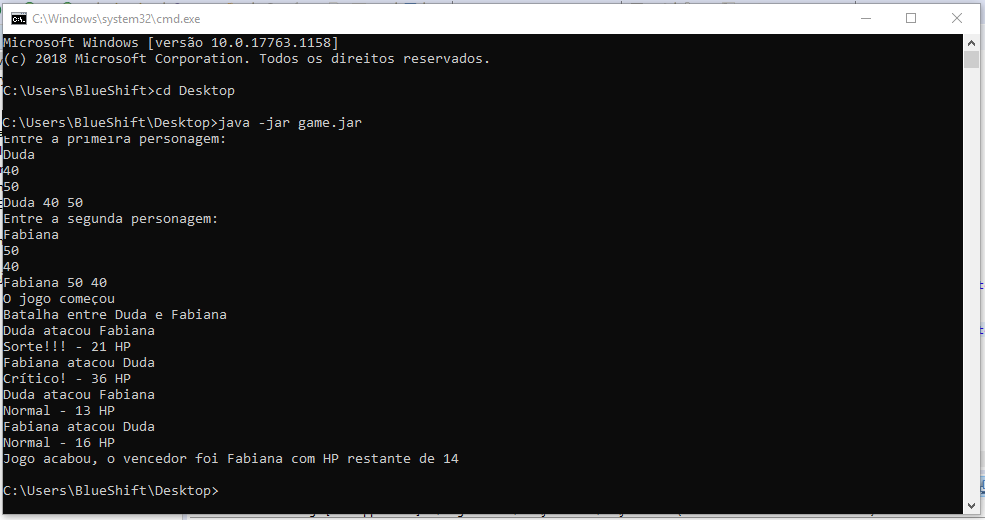

# Manual de instrução
===============================================================================
## Pré-condições:
* Remedação de possuir o java na versão 11 LTS ou superior instalado na máquina. OBS.: Pode rodar com uma versão inferior, mas
pode gerar instabilidades.
* Para realizar o download do game basta acessar o endereço: [download](https://github.com/SelecaoGlobocom/wellington-vieira/blob/game/game/resource/game.jar)

##### Passos:
Para utilizar o jogo de forma adequada, devemos seguir os passos abaixo:
*Abrir o prompt de comando do sistema operacional: (windows - cmd / Linux - shell).
* Navegar até o diretório onde se encontra o "jogo.jar".
* No diretório onde se esta o arquivo jar, devemos execultar o comando: **`java -jar game.jar´**.
* Informar o nome do primeiro jogador. Ex.: Duda 
* Após digitar o nome do primeiro jogador precionar a tecla "Enter".
* Informar o valor referente a energia. Ex.: 40 
* Após digitar o valor de energia do primeiro jogador precionar a tecla "Enter".
* Informar o valor referente a energia. Ex.: 50 
* Será exibido a mensagem: "Duda 40 50".
* Informar o nome do segundo jogador. Ex.: Fabiana
* Após digitar o nome do segundo jogador precionar a tecla "Enter".
* Informar o valor referente a energia. Ex.: 50
* Após digitar o valor de energia do segundo jogador precionar a tecla "Enter".
* Informar o valor referente a energia. Ex.: 40
* Deve exibir a mensagem: "Fabiana 50 40".
* Deve exibir a mensagem: "O jogo começou"
* Deve exibir a mensagem: "Batalha entre Duda e Fabiana"
* Deve exibir a mensagem: "Duda atacou Fabiana"
* Após realizar o ataque, dependendo da intensidade o jogo deve exibir pelo mesmo uma das mensagem abaixo:
- **Errou - 0 HP**
- **Normal - X HP**
- **Sorte!!! - X HP**
- **Crítico! - X HP**
	(Obs.: X indica o valor de dano sofrido.)
* E o jogo vai alternando quem ataca e que sofre o ataque, até que se tenha um vencedor, mediante a sua energia se esgotar.
* Deve ser exibir a mensagem do vencedor. Duda ou Fabiana.

#### Tela Inicial

	